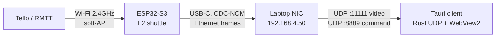

# AIdrone - measuring the USB-NCM path before committing to it

`tellovoice` sends the Tello's video through **Tello -> Wi-Fi -> ESP32 -> lwIP
UDP socket -> WebSocket/TCP -> cloud -> browser**. Two things in that chain cap
what any desktop rewrite can achieve, and neither is fixed by replacing the UI:

- **`CONFIG_LWIP_UDP_RECVMBOX_SIZE` is 6.** The ESP32's own receive mailbox
  holds six datagrams (~8.8 KB). A 720p IDR frame is 20-40 KB. The burst is
  discarded inside the ESP32 before any transport is involved.
- **The relay is TCP.** One lost segment head-of-line-blocks every frame behind
  it, and the same socket carries commands.

This repo tests the replacement: the ESP32-S3 becomes a **USB-C Ethernet
adapter** (CDC-NCM). Tello UDP datagrams cross the cable as Ethernet frames and
land in a plain UDP socket on the laptop. No cloud, no TCP, no lwIP mailbox on
the forwarding path.

The bench existed to decide whether a desktop client was justified. The
measured USB-NCM margin says it is, so `app/` is now the concrete desktop
control surface; the bench remains the evidence for its transport assumptions.



## The three numbers that decide it - measured

Measured 2026-08-08 on a WEMOS LOLIN S3 Mini into Windows 11 `UsbNcm.sys`,
1450 B UDP payloads (1492 B Ethernet frames), 12 s per rate. Raw data:
`desktop/knee.csv`. The 4 and 8 Mb/s rows were reproduced in a separate later
run (3.89 Mb/s at 0.2 ms; 5.79 Mb/s at 25.5% loss and 65 ms) after a reflash.

| requested | delivered | loss | added delay | ring |
|---|---|---|---|---|
| 2 Mb/s | 1.94 Mb/s | **0.000%** | 0.7-1.2 ms | idle, hi 1.5k |
| 4 Mb/s | 3.89 Mb/s | **0.000%** | 0.12-0.30 ms | idle, hi 1.5k |
| 5 Mb/s | 4.86 Mb/s | **0.000%** | 0.20-0.34 ms | idle, hi 1.5k |
| 6 Mb/s | **5.79 Mb/s** | 0.000%, then 0.6% | **17 -> 84 ms, climbing** | fills 13k -> 62.7k |
| 7 Mb/s | 5.79 Mb/s | 14.9% | ~74 ms | pinned full, drop 87/s |
| 8 Mb/s | 5.79 Mb/s | 25.5% | ~65 ms | pinned full, drop 171/s |

**1. Sustained goodput: 5.79 Mb/s.** Hard ceiling - identical for 6, 7 and 8
Mb/s requests, at exactly 500 frames/s. That is 48% of Full-Speed's 12 Mb/s
nominal and ~60% of the 9.7 Mb/s bulk-payload theoretical, the rest going to
NCM/NTB framing. The ESP32-S3's native USB is Full-Speed only, so this number
cannot be raised by tuning - only by moving to a High-Speed part.

**2. Loss: zero below the knee, and the two sides agree exactly.** At 7 Mb/s
the ESP32 reports `q=587/s drop=87/s tx=500p` and the host reports 14.9% loss;
87/587 = 14.8%. At 8 Mb/s, 171/671 = 25.5% against a measured 25.5%. Every
packet is accounted for on one side or the other, so `q = tx + drop` holds and
neither counter is inventing numbers.

**3. Delay variation is the real limit, and it bites *before* loss does.** The
6 Mb/s row is the important one: zero loss, but latency climbing linearly
17 -> 84 ms over 11 s. Requesting 210 kb/s more than the link can carry does
not drop anything at first - it fills the 64 KB ring, and standing queue is
latency. The delay is exactly the ring: 62.7 KB / (5.79 Mb/s / 8) = **86 ms**,
against 84-91 ms measured.

> **The ring is a latency knob, not a safety margin.** 64 KB buys 86 ms of
> buffering at line rate. For video that is a reasonable jitter absorber; for a
> control loop it is 86 ms of stale input. Size it for the deadline you need,
> and treat "delay climbing at constant loss=0" as the saturation alarm -
> waiting for `loss>0` reports the problem ~11 s late.

`drop=` in the firmware's stats line and `loss=` in the receiver's are
deliberately separate: together they say *which side* lost the packet.

### Practical operating points

- **<= 4.86 Mb/s: safe.** Zero loss, sub-millisecond added delay.
- **~5.8 Mb/s: the cliff.** Deliverable, but any excess becomes queue delay.
- **Tello 720p H.264 runs 1-5 Mb/s** (`setbitrate 1..5`). At the default it
  fits with ~3x headroom; at `setbitrate 5` the margin is gone, because the
  Wi-Fi leg's own overhead lands on top.

Every run in the table shows `wifi rx host=0 grp=0` - no drone attached, so
those numbers characterise the USB cable alone. The **Wi-Fi leg** has since been
measured with a real Tello; see *Status*.

## Layout

```
firmware/          PlatformIO, ESP32-S3 (WEMOS LOLIN S3 Mini, N16R8)
  src/ncm.cpp      CDC-NCM class + drop-oldest ring + transmit pump
  src/shuttle.cpp  Wi-Fi AP <-> USB layer-2 shuttle with MAC demux
  src/bench.cpp    synthetic UDP generator (no drone needed)
  src/main.cpp     console + 1 Hz stats
app/               Tauri desktop client (Rust sockets + WebView2 UI)
  src-tauri/       tello.rs (SDK/UDP), video.rs (reassembly + stamp), h264.rs (native decode), vision.rs (bounded marker/YOLO worker), apriltag3.rs (the marker engine), lib.rs
  src/transport.ts typed Tauri command/event bridge
  src/render.ts    WebCodecs decode -> canvas
  src/lib/aruco.ts native-observation state, target selection, and UI listeners
  src/screens/     the station shell - the only screen
  src/panels/      mode selector, key map/RC, vision, telemetry, console, copilot, timeline
  src/ui.ts        typed DOM helpers and clamped numeric input binding
desktop/ports.ps1     serial ports + network adapters, one snapshot
desktop/nicstate.ps1  is the NCM adapter Up, and does it hold its IP
desktop/nic-setup.ps1 one-time static IP + firewall (self-elevating)
desktop/nic-restart.ps1 bounce the adapter and restore the IP (self-elevating)
desktop/fake-tello.ts   SDK + H.264 simulator: the app with no drone, no cable
desktop/console.ps1     read the device's 1 Hz console (COM10 - never COM18)
desktop/console-cmd.ps1 send it one verb; `i` reports the soft-AP and lease
desktop/exit-latency.ps1 how long the app takes to exit after the titlebar X
```

## Build and flash

```bash
cd firmware
pio run -t upload
```

Before a firmware build, create the ignored per-device configuration and set
the credentials already provisioned on the Tello:

```bash
cp src/config.h.example src/config.h
# edit src/config.h: uncomment and set AIDRONE_WIFI_SSID/AIDRONE_WIFI_PASS
```

`config.h` is intentionally not versioned. The template fails the build until
both deployment credentials are supplied, which prevents a public source clone
from silently broadcasting a placeholder Soft-AP.

The board definition hardcodes `ARDUINO_USB_MODE=1` (USB-Serial-JTAG), which
parks the USB-OTG controller that TinyUSB needs; `platformio.ini` unflags it.
`board_build.arduino.memory_type = qio_opi` is also mandatory on the N16R8
module - the default `qio_qspi` cannot handshake its octal PSRAM and the board
crash-loops in the bootloader.

After the first flash the device enumerates as a TinyUSB composite (CDC + NCM),
not as USB-Serial-JTAG. If the upload port stops auto-resetting, hold **BOOT**
and tap **RESET**.

## Host NIC setup - done by the installer

The adapter appears as **"AIdrone NCM"** and needs a **static** address: there
is no DHCP server on the host's side of the link (see *Why no host DHCP*
below). The driver half is genuinely plug-and-play on both targets - Windows 11
binds its in-box `usbncm.inf` and Ubuntu its in-box `cdc_ncm`, with nothing to
download - so the address is the only thing left, and both installers do it.

**Windows.** The per-machine NSIS installer requires a UAC approval, adds the
inbound UDP rules (9999, 11111, Private profile), and registers the scheduled
task **AIdrone Link**. The task runs
`installer/windows/aidrone-link.ps1` as SYSTEM at logon and on device arrival.
It identifies the adapter by `USB\VID_303A&PID_8AD1`, never by a mutable
`InterfaceAlias` such as `Ethernet 2`. With no node attached it exits 0 without
touching another NCM adapter; its transcript is
`%ProgramData%\AIdrone\link.log`.

**Ubuntu.** Install the release-specific `.deb` with
`sudo apt install ./AIdrone_0.1.17_amd64.deb`, then unplug/replug the board. The
package installs a udev rule that renames the MAC-derived `enx…` interface to
**`aidrone0`**, then a NetworkManager profile bound to that name assigns
`192.168.4.50/24` with `never-default=true`. If NetworkManager is absent (it is
a `Recommends`, not a `Depends`), `postinst` prints the manual `ip addr add`
command instead. Package defaults update only while these two `/etc` files are
unmodified; local subnet/rule edits survive upgrades and purge.

The video canvas uses WebKitGTK's WebCodecs implementation. Its H.264 decoder
is a GStreamer plugin discovered at runtime rather than an ELF dependency, so
the `.deb` explicitly **Depends** on `gstreamer1.0-libav`. The original
release omitted that plugin: on an affected installation, install it, fully
quit AIdrone, then reopen and reconnect:

```bash
sudo apt update
sudo apt install -y gstreamer1.0-libav
```

`gstreamer1.0-libav` supplies `avdec_h264`, the software decoder this
application pins on Linux. It is available on Ubuntu 22.04, 24.04, and 26.04.

**Why it is pinned.** WebKitGTK's WebCodecs backend does not act on the
`hardwareAcceleration: "prefer-software"` hint the decoder is configured with -
it takes whichever GStreamer element ranks highest for the caps. On a machine
that also has a VA-API or NVDEC plugin installed that is a hardware decoder,
and the Tello's SPS carries no VUI, which is the stream shape those handle
worst: the equivalent Chromium path filled a 12-frame DPB (see *the 502 ms
reading was the decoder's DPB* below) and WebKitGTK fails outright with a bare
`decode error`. So the app publishes, before WebKit forks its web process:

```
GST_PLUGIN_FEATURE_RANK=avdec_h264:MAX,vah264dec:NONE,vah264lpdec:NONE,
vaapih264dec:NONE,nvh264dec:NONE,nvh264sldec:NONE,v4l2h264dec:NONE,
v4l2slh264dec:NONE,msdkh264dec:NONE
```

Setting `GST_PLUGIN_FEATURE_RANK` yourself disables that default entirely -
the app never overwrites an operator's value. To see what the machine offers,
run `gst-inspect-1.0 | grep -i h264`.

**Reading a failure.** When the picture never arrives the app now names the
decision it made:

```
video did not paint within 5000 ms
  (decoder: No decoder found for codec avc1.42c01f;
   codec avc1.42c01f, isConfigSupported=false)
```

`isConfigSupported=false` means this WebView has no H.264 decoder at all -
install `gstreamer1.0-libav`. `isConfigSupported=true` with a decoder error
means one was found and the stream broke it, which is the hardware-element
case above; check whether `GST_PLUGIN_FEATURE_RANK` is being overridden.

Neither assigns a default gateway. One here would route the machine's internet
traffic down a USB cable to a drone.

### Linux release format

Only release-targeted `.deb` artifacts are published for Ubuntu. An AppImage
cannot run the `.deb` maintainer scripts or declare WebKitGTK's dynamically
loaded `gstreamer1.0-libav` H.264 decoder, so it is not a supported portable
distribution for this application. Use the `.deb` for a normal plug-and-play
Ubuntu install.

### Updating itself

On launch the app asks GitHub for this project's newest release, and offers it
in the top bar when it is newer than the running build. Accepting it
downloads the artifact for this exact platform, checks the SHA-256 GitHub
publishes beside it, installs, and restarts.

It is hand-written (`src-tauri/src/update.rs`) rather than
`tauri-plugin-updater` for one reason: the plugin cannot update a `.deb`, and
on Ubuntu the `.deb` is the only artifact that can declare
`gstreamer1.0-libav` and run the USB-NCM maintainer scripts.

What it will and will not do:

- **Only while the link is down.** The installer replaces the binary
  underneath a running process, so the offer is rendered only when the
  supervisor reports offline, and `applyUpdate()` refuses again on the same
  condition so a click landing during a reconnect cannot get through.
- **Only an artifact it can check.** An asset GitHub reports no digest for is
  not offered at all, and a download whose SHA-256 does not match is deleted
  rather than installed. This is integrity, not provenance: it proves the bytes
  are the ones GitHub holds. Signed updates would need a signing key in CI.
- **Only this project's releases.** The download URL is required to sit under
  `https://github.com/KimMgyo/AIdrone/releases/download/`.
- **Only the matching Ubuntu.** `/etc/os-release` picks `_ubuntu22`, `_ubuntu24`
  or `_ubuntu26`; an unrecognised distribution is offered nothing, because the
  wrong libc baseline is worse than an old build.
- **One OS prompt, unavoidable.** Windows raises UAC for the per-machine NSIS
  installer; Linux takes the cheapest root available - already root, then
  passwordless `sudo`, then `pkexec`'s desktop dialog - and says so plainly
  when it has none of them.

`AIDRONE_UPDATE_DRY_RUN=1` stops after the checksum and reports where the
artifact landed. It exists because the install step is the one part that cannot
run unattended: UAC lives on Windows' secure desktop, which no automation may
touch.

**Two things the end-to-end test caught that no unit test would have.** Both
were found by installing an old build, clicking the button, and watching:

1. **`GET /releases` is not newest-first.** Page one of this repository came
   back `0.1.2`, `0.1.11`, `0.1.8` - tag order, and the tag is a commit SHA, so
   effectively arbitrary. Taking the first newer entry offered a build from
   hours earlier and missed the current one. It now takes the **highest**
   version any release offers, over a 40-release page.
2. **The installer has to leave this app's process group.** A plain child dies
   with whatever supervises the app: the script was written, the app exited,
   and `apt` never ran. `setsid` on Linux and `DETACHED_PROCESS` on Windows are
   what make the handoff survive the process it replaces.

Verified end to end on Ubuntu 26.04: 0.1.14 offered 0.1.15, downloaded 87 MB,
matched the digest, `apt-get install` ran, and the new build came back up - 40
seconds from click to a running 0.1.15. On Windows the same path was verified
through the checksum with `AIDRONE_UPDATE_DRY_RUN=1` (123 MB, staged, install
skipped); the UAC step itself is the one thing a person still has to click.

### Doing it by hand

Only needed when running from a source build rather than an installed package.

```powershell
Get-NetAdapter | Where-Object InterfaceDescription -Match 'NCM'
New-NetIPAddress -InterfaceAlias 'Ethernet 2' -IPAddress 192.168.4.50 -PrefixLength 24
Set-NetConnectionProfile -InterfaceAlias 'Ethernet 2' -NetworkCategory Private
New-NetFirewallRule -DisplayName 'AIdrone UDP' -Direction Inbound -Protocol UDP `
  -LocalPort 9999,11111 -Profile Private -Action Allow
```

Substitute the real `InterfaceAlias` from the first command. The firewall rule
matters: Windows silently drops inbound UDP on a new adapter by default, which
looks exactly like a dead link.

```bash
ip -br link | grep -i enx           # the NCM adapter, e.g. enx0242ab...
sudo ip addr add 192.168.4.50/24 dev enx0242ab...
sudo ip link set enx0242ab... up
```

Verify on either OS with `bun desktop/rx.ts probe` - it broadcasts on the
subnet once a second and prints anything that answers.

## Working on the UI, in a browser

A Tauri build is 90 seconds and a UI question is usually one line of CSS, so
the frontend also runs in a plain browser against a mock drone, with Vite's
hot reload:

```bash
cd app
bun run dev                      # http://localhost:1420
```

`src/dev/tauri-mock.ts` installs `window.__TAURI_INTERNALS__` itself, so the
mock sits *below* `transport.ts` and every screen, panel and renderer above it
runs exactly the code that ships - no branch, no second transport to keep in
step. `import.meta.env.DEV` gates the import, so none of it reaches a release
bundle. The video is the repository's own `sample.h264`, served by a dev-only
Vite middleware and decoded by the real `VideoRenderer`, so latency readouts
and dropped-frame counters are real measurements of the real pipeline.

A layout is judged in its states, not its happy path, so the mock takes flags:

| flag | what it puts on screen |
|---|---|
| `?bat=14` | holds the battery there; the colour thresholds are 30 and 15 |
| `?update=1` | the "new version" chip - pair with `?empty=1`, it only shows while offline |
| `?empty=1` | no video, so the first-paint gate fails and its error is visible |
| `?silent=8` | the datapath reports silent 8 s in, frames keep coming - the supervisor must not reconnect |
| `?stall=6` | the frames stop 6 s in with the session still up - the supervisor must notice and dial again |
| `?nonode=1` | the node's adapter is absent - NODE reads 없음 and DRONE reads `--` |
| `?wedged=1` | the drone answers and never streams, the one failure needing hands on the aircraft |

Flags are read at call time rather than snapshotted at import, so
`history.replaceState({}, "", "/")` from the console flips one live. That is
how "the node arrives after the app started" is exercised without a cable: a
transition is a state too, and it was the one carrying a bug.

What it is not: a simulator. Nothing here models a drone, and a protocol
question belongs to `desktop/fake-tello.ts` against the real binary. The
copilot answers a canned line and issues no tool calls, because a mock that
pretended to fly is the one thing here that could mislead.

## Building the installers

```bash
cd app
bun install
bun run tauri build --bundles nsis           # Windows -> AIdrone_0.1.17_x64-setup.exe
bash src-tauri/installer/linux/build-deb.sh  # Ubuntu  -> AIdrone_0.1.17_amd64.deb
```

Windows additionally needs `FFMPEG_DIR` pointing at a shared FFmpeg build and
`LIBCLANG_PATH` for bindgen. Ubuntu needs:

```bash
sudo apt install -y libwebkit2gtk-4.1-dev libgtk-3-dev librsvg2-dev \
  libayatana-appindicator3-dev libasound2-dev clang libclang-dev cmake \
  build-essential pkg-config libssl-dev libavcodec-dev libavformat-dev \
  libavutil-dev libswresample-dev libswscale-dev
```

### Which Ubuntu, and why the .deb is not portable between them

Building from source works on every current LTS - verified by compiling on
each, not inferred:

| Release | FFmpeg | `libavcodec` | source build |
|---|---|---|---|
| 22.04 jammy | 4.4 | 58 | ok |
| 24.04 noble | 6.1 | 60 | ok |
| 26.04 resolute | 8.0 | 62 | ok |

The **package**, however, is only good on the release that produced it. The
binary links a specific FFmpeg SONAME and Ubuntu renames the package along with
it, so a `.deb` built on 24.04 is rejected outright on 26.04:

```
E: Unable to satisfy dependencies.
   a-idrone:amd64=0.1.0 Depends libavcodec60
   but none of the choices are installable: [no choices]
```

That is the good failure - apt refuses rather than installing something that
would die at exec time. Build on the release you ship to.

`installer/linux/build-deb.sh` is the **only release command for a `.deb`**:
it builds once, reads the resulting binary's `DT_NEEDED` entries, resolves each
to its owning package on the build host, explicitly adds
`gstreamer1.0-libav` for WebKitGTK's dynamically discovered H.264 decoder,
removes that throwaway pass, then bundles and verifies the one release
artifact. The static `depends` in `tauri.linux.conf.json` is only a 24.04
fallback for exploratory plain `tauri build`; do not ship it as a cross-release
package.

`installer/linux/verify-deb.sh` is the check underneath it, and can be run on
its own. It reports both directions - a library that is linked but undeclared,
a declared name that no package on this release provides, and the required
GStreamer H.264 plugin that `DT_NEEDED` cannot see:

```bash
bash src-tauri/installer/linux/verify-deb.sh \
  src-tauri/target/release/bundle/deb/AIdrone_0.1.17_amd64.deb
```

The 64-bit `time_t` renames deliberately need no per-release handling:
`libasound2t64` and `libgtk-3-0t64` still *Provide* the old names, and both
scripts resolve them the way apt would.

### Verifying the installers

```powershell
powershell -File src-tauri/installer/windows/verify-nsis.ps1
```

A compiled NSIS installer cannot be inspected directly - its header is
compressed, so grepping the `.exe` finds nothing whether the hooks ran or not.
The check reads the generated `installer.nsi` beside it and confirms the
per-machine/elevated mode, hook inclusion, `$PLUGINSDIR` initialization before
task XML creation, both task event subscriptions, the installed script path,
and every non-system DLL imported by `app.exe`. `bundle.resources` land
directly under `$INSTDIR` mirroring their source paths, **not** under a
`resources` subdirectory; a task pointed at the latter compiles, installs, and
then silently does nothing forever.

### GitHub continuous builds

Every push to `main` runs `.github/workflows/release.yml`. GitHub builds the
Windows NSIS installer plus a release-targeted `.deb` on each supported Ubuntu
runner: 22.04, 24.04, and 26.04. Ubuntu assets carry an `_ubuntu22`,
`_ubuntu24`, or `_ubuntu26` suffix so their libc baseline is explicit and no
matrix artifact can overwrite another. The 26.04 runner is
GitHub's public-preview image. All assets are published as a unique prerelease
tagged `build-<full commit SHA>`; the tag is unique per commit, so rerunning a
workflow updates that commit's assets rather than overwriting another build.
These are continuous builds, not manually promoted stable releases.

### Bundled ONNX Runtime

Person detection uses the pinned ONNX Runtime **1.28.0 CPU** library shipped
with the application; it is not a host package or a developer-machine
dependency. The app resolves the Tauri resource and initializes that exact
library before it opens a YOLO session.

| Artifact | Runtime path | Notices |
|---|---|---|
| Windows NSIS install | `$INSTDIR\onnxruntime\windows-x64\onnxruntime.dll` | `$INSTDIR\onnxruntime\LICENSE`, `$INSTDIR\onnxruntime\ThirdPartyNotices.txt` |
| Ubuntu `.deb` | `/usr/lib/AIdrone/onnxruntime/linux-x64/libonnxruntime.so.1.28.0` | `/usr/lib/AIdrone/onnxruntime/LICENSE`, `/usr/lib/AIdrone/onnxruntime/ThirdPartyNotices.txt` |

`onnxruntime_providers_shared` is installed beside the runtime on both
platforms. Keep that sibling and the notices when repackaging; replacing the
library with a system copy changes the tested ABI and is unsupported.

Windows releases also pin the **Microsoft.AI.DirectML 1.15.4** redistributable.
CI stages its `bin/x64-win/DirectML.dll` before packaging; the installer places
it at `$INSTDIR\DirectML.dll` and carries the package `LICENSE.txt` plus
`ThirdPartyNotices.txt` at `$INSTDIR\directml`. It is never taken from a
developer's ignored `target/` tree.

## Procedure A - the USB link alone

No drone required. This isolates the cable from every Wi-Fi variable.

1. Open the ESP32 console (`pio device monitor`, or any terminal on the CDC
   port) and detach the Wi-Fi leg so nothing competes:

   ```
   w off
   ```

2. Start the receiver:

   ```bash
   bun desktop/rx.ts bench --for 60 --csv bench-5m.csv
   ```

3. Start the generator at the Tello's realistic worst case and walk it up:

   ```
   b 2000        # 2 Mbps
   b 5000        # 5 Mbps - RMTT's setbitrate ceiling
   b 8000        # past the point USB Full-Speed can hold
   ```

Both sides print once a second. The firmware's `usb tx=` is what left the
ESP32; the receiver's `rx=` is what arrived. Where they diverge is the answer.
(The firmware's stats line carries an `rx=` of its own - frames the host sent
*us* - which is a different number; see the stats-line guide.)

## Procedure B - the real Tello

1. Power the Tello. It already stores `ap <deployment Soft-AP SSID> <deployment Soft-AP passphrase>` from
   `tellovoice`, so it joins on its own; `ap=1` appears in the stats line and
   `i` prints the lease it was given.
2. Re-attach the shuttle (`w on`) and stop the generator (`s`).
3. `bun desktop/rx.ts video --ip 192.168.4.2 --csv video.csv` - it sends
   `command`, then `streamoff` at 0.7 s and `streamon` at 1.4 s (plus
   `setbitrate` at 2.1 s if `--bitrate` was given), and measures the stream. The
   `streamoff` is not optional; see *Drone-side findings*.

The Tello chunks each frame into 1460-byte datagrams and ends it with a short
one, so `rx.ts` reports true **fps** and **per-frame bytes** without decoding
anything. `--bitrate N` passes `setbitrate N` (1-5) to sweep the load.

### Drone-side findings - the counters proved these were not the link

Both were blamed on USB first. Comparing the two sides is what cleared it: the
device reported a healthy link and the host NIC was `Up 12 Mbps` in each case,
which leaves the drone.

**A Tello left believing it is streaming answers `ok` to `streamon` and then
sends nothing.** Measured: 2 s of frames, then 118 dead seconds, while the drone
answered `battery? 74` and the device showed `wifi rx host=10/s` - status
broadcasts only - with `stall=0` and `drop=0`. An explicit `streamoff` first
fixed it immediately: `wifi rx host=126/s`. That is why `rx.ts video` now always
sends `command` -> `streamoff` -> `streamon` instead of `command` -> `streamon`.

**At `battery? 21` the Tello answers `ok` to `streamon` and stops after ~2 s.**
Swapping to a charged pack (`battery? 74`) restored full streaming. Ask the
drone before suspecting the link: a stream that dies while both sides' counters
stay clean is the drone's doing.

A *flat* pack goes one step further: the Tello stays associated - `clients: 1`
with its lease still held at `192.168.4.2` - while sending nothing at all
(`wifi rx host=0`, not even the status broadcast) and answering neither
`command` nor `battery?`. Association is not liveness; `wifi rx host=` is.

`temph?` is rejected by this unit - `unknown command: temph?`. `battery?`,
`tof?`, `sdk?`, `sn?`, `wifi?` and `time?` all answer.

## Design notes

**Why NCM and not ECM or RNDIS.** CDC-NCM is the only network class with an
in-box driver on *both* targets: Windows 11 ships `UsbNcm.sys` and Linux ships
`cdc_ncm`. ECM has no in-box Windows driver. RNDIS is being removed from modern
Linux. The prebuilt Arduino TinyUSB has `CONFIG_TINYUSB_NCM_ENABLED=1` already,
and ECM/RNDIS compiled out - so NCM is also the only one reachable without
rebuilding the framework's static libs.

**Endpoint budget.** The Arduino core allows 5 IN endpoints. CDC reserves
OUT3/IN4/IN5; NCM adds a notification IN plus a bulk pair sharing one endpoint
number. Four IN endpoints in use. Console and NIC fit on one cable.

**Registration runs in a global constructor.** With `ARDUINO_USB_CDC_ON_BOOT=1`
the core calls `USB.begin()` -> `tinyusb_init()` from `app_main()`, before
`setup()`. `-DARDUINO_USB_ON_BOOT=0` cannot prevent it, because `USB.h:25`
redefines that macro unguarded. So `ncm.cpp` registers its interface from a
static object, the same trick `USBCDC` itself uses: C++ constructors run in
`do_global_ctors()` before `app_main()` is entered.

**Drop-oldest, not block.** The ring evicts its oldest frame when full. For
live video a stale frame has negative value, and back-pressure would only
convert loss into latency that never drains. `hi=` in the stats line is the
peak fill - if it approaches `NCM_RING_BYTES`, raise the ring rather than
accept the drops.

**Why the shuttle demultiplexes.** `esp_wifi_internal_reg_rxcb()` supports one
callback per interface, so registering ours *replaces* esp_netif's. Consuming
everything would deafen the soft-AP's own DHCP server and the Tello would never
get a lease. The callback therefore splits on destination MAC: broadcast and
multicast go to both sides, unicast to the ESP32's AP MAC goes to lwIP, and
everything else goes straight to the laptop.

**Why no host DHCP.** The reverse direction would need host frames injected
into lwIP via `esp_netif_receive()`. `CONFIG_LWIP_L2_TO_L3_COPY` is *not* set
in the Arduino sdkconfig, so that path allocates `PBUF_REF` and keeps
referencing the caller's buffer - which for us is a TinyUSB buffer recycled the
instant `tud_network_recv_cb()` returns. A static host IP costs one setup
command and avoids a use-after-free.

**`tud_network_xmit_cb()` is synchronous.** TinyUSB's NCM driver calls it from
inside `tud_network_xmit()`, so the staging buffer is free again the moment
that returns - one staging buffer, no in-flight ownership tracking. The pump
pops from the ring *before* asking `tud_network_can_xmit(len)`, because asking
with one length and transmitting a longer frame would overrun the NTB the
driver just sized.

### Two defects this rig actually caught

Both were found only because the device's counters and the host's were compared
against each other. Either one alone looked healthy.

**1. Every driver call must land in the TinyUSB task (fixed).** The first build
called `tud_network_can_xmit()` / `tud_network_xmit()` from a producer task. It
ran fine to 8 Mb/s, then at 12 Mb/s **wedged permanently**: `tud_network_xmit()`
never returned true again, the pump spun on a `pending` frame forever, and the
ring evicted every single frame - `q=1007/s drop=1007/s tx=0p stall=1001/s`,
for 160+ s, never recovering. Restarting the generator did not clear it.

The cause is `xmit_put_ntb_into_ready_list()`: TinyUSB's NCM driver hands NTBs
between `tud_network_xmit()` and `tud_network_xmit_cb()` through arrays with no
lock, on the assumption that both run in the TinyUSB task. Race them from
another task and an NTB is lost to both sides - unrecoverable from outside the
driver. The fix routes the whole TX path through `usbd_defer_func()`, so the
pump executes *inside* the TinyUSB task; the producer only writes the ring. The
same sweep that killed the old build now runs through 12 Mb/s untouched.

`recover_link()` (disconnect/connect after `kStallRunLimit` failed steps) is the
backstop, not the fix - a leaked NTB can only be reclaimed by making the host
re-enumerate.

**2. `link_up()` cannot see a dead host datapath, and the failure has two
shapes.** The Windows adapter goes **`Disconnected`, LinkSpeed 0, host IPv4
gone** while the ESP32 keeps printing `usb=up`: `link_up()` is `tud_ready()`,
"USB is configured", which is strictly weaker than "the NIC is up". Measuring
the refusal counter split that failure in two, and the split is what decides who
can fix it.

**REFUSES.** `tud_network_can_xmit()` rejects every frame indefinitely. Measured
signature: `stall` pinned at ~1128-1130 per second, `usb tx=0p 0.00Mb/s`, the
ring pinned at high-water `hi=64.0k` shedding `drop=131/0` per second, `wifi rx
host=131` per second still arriving from the drone, and `usb=up` - `tud_ready()`
still true - the whole time. This shape the device can both see and cure: the
stall watchdog bounces USB. Verified live, stalls went from ~1128/s to 0 and TX
resumed immediately.

**ACCEPTS.** The host takes every frame at full rate and discards it, so the
device streams into a pipe with no other end. Every device-side counter reads
healthy - `stall=0`, `drop=0`, `usb tx` climbing normally - so this shape is
invisible from the device and belongs to the host. NCM exposes no
datapath-liveness signal, and `tud_network_init_cb()` is an ECM/RNDIS-era
callback the NCM driver never invokes - verified, a full
`tud_disconnect()`/`tud_connect()` cycle that the host sees as a replug leaves
it untouched. A counter built on it would never increment, so there is none.

ACCEPTS has a transient form that is real and self-healing: during a clean 90 s
video run the host receiver saw zero packets for exactly 6 s (t=42..47) while
the device console showed `wifi rx host=132` per second arriving and
`usb tx=132p` per second leaving with `drop=0`, then it resumed at full rate
with nothing intervening. The persistent form needs a host-side cure, and no
cheap one is reliable. One episode was cured by `desktop/nic-restart.ps1`
(`Restart-NetAdapter`, then re-add the static IP): the device had already been
transmitting cleanly - `stall=0`, TX flowing, ring draining - while Windows
still reported `Disconnected / 0 bps`, and the restart brought it back to
`Up 12 Mbps` with `192.168.4.50` restored. A later episode refused exactly that
treatment. Tried in this order against one wedged adapter, while the device
reported `usb=up`, `stall=0`, `rx=0`, `recov=0/2` throughout:

| attempt | host adapter after |
|---|---|
| `nic-restart.ps1` alone | `Disconnected / 0 bps` |
| `x` (3 s bounce), waited 12 s | `Disconnected / 0 bps` |
| `x`, then `nic-restart.ps1` | `Disconnected / 0 bps` |
| reflash (~12 s held in ROM) | `Up 12 Mbps` within 8 s |

The 3 s detach is an improvement on 50 ms, not a guarantee. The only cure that
has never failed is a *long* absence, so budget for a reflash or a physical
unplug when a bounce does not take.

**A device-side host-silence watchdog was built, measured, and removed.** It
armed on "no host frames arriving while we transmit", which is undecidable on
this side: with no receiver running the host is legitimately quiet, and Windows
on its own emits ARP/mDNS bursts that sustain a 3-second streak, so neither
silence nor traffic distinguishes a dead datapath from an idle one. Measured
harm: it bounced USB every few seconds, and because the bounce is a 3 s detach
Windows played a device disconnect/connect chime on every cycle - the operator
heard it from across the room. It cured nothing. The transient above is the
second reason it is gone: it would have replaced a hiccup that heals itself in
~6 s with that hiccup *plus* a forced 3 s outage.

What remains is the stall watchdog - `kStallRunLimit = 1000` consecutive
refusals in `ncm.cpp` -> `recover_link()` - which only fires on REFUSES. Gating
*that* on "host frames arrived during the stall run" was added and removed as
well: it suppressed the cure in the exact case the cure exists for (measured:
`stall=1128/s`, `tx=0p`, `recov=0/0`, no recovery). All bounces now share one
cooldown, `kBounceCooldownMs = 30000` - at most one 3 s bounce per 30 s, no
matter which path asks. That is what makes an audible loop structurally
impossible rather than merely unlikely.

**`x` is a USB bounce, not a device reset.** It calls `ncm::recover()`:
`tud_disconnect()`, `vTaskDelay(kBounceDetachMs)`, `tud_connect()`, with
`kBounceDetachMs = 3000`. The 3 s is measured, not chosen - a 50 ms detach left
Windows holding the same wedged NIC instance: the device re-enumerated, PnP
reported the NCM function OK, and the adapter stayed `Disconnected / 0 bps`.
Verified on a live REFUSES failure, `x` took stalls from ~1128/s to 0 with TX
resuming - but that is the device's half only, and Windows still needed
`nic-restart.ps1` for its own. Against a persistent ACCEPTS adapter neither
step took; see the ladder above.

**Detection lives in the receiver.** Both measuring modes in `desktop/rx.ts`
send a 1 Hz `AIDR-HB` datagram to `192.168.4.1:9998`. Nothing listens on the far
side and nothing needs to; the point is that the host is provably transmitting,
which is what gives the device's `rx=` counter a meaning to whoever is reading
the console. After a stream that *was* arriving goes fully silent for
`SILENT_VERDICT_S = 10` seconds, `rx.ts` prints a verdict naming the check and
both cures: `nicstate.ps1` to confirm `Status=Disconnected / 0 bps`, then `x` on
the ESP32 console or `nic-restart.ps1`. The threshold is 10 s and not 3 s
precisely because the self-healing transient is 6 s, and there is now exactly
one implementation of it, in `startHeartbeat()`.

What does *not* trigger either shape: 32 s of deliberate oversubscription at
8 Mb/s, ring pinned full, 25% loss - the link stayed `Up` throughout. Across
three occurrences the correlate was CDC port open/close churn (attaching and
detaching the serial monitor on the same composite device), not traffic. That is
[INFERENCE] from three samples, not a proven mechanism.

## Console

```
b [kbps] [payload]   start the bench (default 2000 kbps, 1450 B payload)
s                    stop the bench
w on|off             attach/detach the Wi-Fi shuttle's USB leg
r                    reset counters
i                    info
x                    bounce USB 3 s - revives a dead host NIC
h                    help
```

Stats line, one per second (it wraps in a narrow terminal):

```
[    12s] usb=up   ap=1 | wifi rx host=418 grp=2 self=0 tx=6 err=0 | ring q=418 hi=4.4k drop=0/0 | usb tx=418p 4.99Mb/s rx=1 stall=0 recov=0/0
```

`drop=A/B` is A ring evictions (too slow) and B oversize rejects. `stall=`
counts times `tud_network_can_xmit()` refused the frame. `rx=` is Ethernet
frames the **host** sent us: the only sign of life from the far end, and context
for a human rather than something a watchdog can act on (defect 2) - `rx.ts`'s
1 Hz heartbeat is what makes it readable. `recov=D/T` is D link bounces in this
second and T since boot; the running total exists because a bounce takes the USB
link down, so the very line that reports it is the one most likely to be lost -
during debugging a 96 s hole in the console hid whether the device had bounced
once or was bouncing in a loop.

Read them in this order:

- **`hi=` climbing toward `NCM_RING_BYTES` with `drop=0`** is the saturation
  alarm. It fires ~11 s before any loss appears, and what it is really
  reporting is *latency* - a full 64 KB ring is 86 ms of standing queue.
- **`drop=` non-zero** means the ESP32 could not keep up: the link is already
  saturated and the ring is now shedding.
- **`stall=` non-zero per second is not a defect.** Healthy Tello video runs
  ~250-280/s: every frame succeeds after a few refusals, so the *consecutive* run
  never approaches `kStallRunLimit`. The fault is a sustained run with
  `usb tx=0p` - ~1130/s with nothing leaving is the REFUSES shape, and the
  watchdog bounces on it.
- **Everything healthy but the host receives nothing** is the ACCEPTS shape;
  `rx.ts` says so after 10 s. Confirm with `desktop/nicstate.ps1`
  (`Disconnected / 0 bps`), then `x` for the device's half and
  `desktop/nic-restart.ps1` for Windows's. See defect 2 above.

## Desktop app - the receive-to-paint budget

`app/` is the Tauri client this bench justified. Rust owns the UDP sockets and
stamps every reassembled frame with the wall clock at its last datagram - 8
bytes of little-endian microseconds prefixed to the Annex-B payload, shipped
with the pixels rather than in a side channel that could drift out of step with
them. The WebView decodes with WebCodecs and paints to a canvas, then subtracts
the stamp from its own clock.

The live UI is a ground station, not a floating viewer:

- `src/screens/station.ts` is the only screen. There is no landing step and no
  connect button: the supervisor in `main.ts` dials on boot and keeps dialling,
  and the shell reports what it is doing through one link chip and the hatch
  over the stage. It docks a 4:3 canvas between two 300 px rails. Its
  exclusive left-rail mode selector exposes manual keyboard control, native
  person tracking, and a native detector-only ArUco surface; telemetry remains
  below. The right rail holds the LLM copilot and an action
  timeline; the stage owns the UDP command console and video overlay.
  Its measurement preserves the decoded video aspect ratio rather than
  stretching the drone image.
- Manual mode alone enables flight keys. Level controls emit `rc` at 10 Hz while
  a key is held and one neutral command on release. `T`, `L`, `Space`, and
  `Escape` are one-shot actions; text inputs retain their own keyboard handling.
  `Ctrl+B` toggles the left rail, `Ctrl+J` toggles the console, and `f` toggles
  native-window fullscreen. The displayed `F1`/`F2`/`F3` labels are mode
  affordances, not global flight key bindings.
- The copilot is a real agent: Gemini function calling, executing without a
  per-action approval dialog. Its vocabulary is 11 tools - `fly`, `rotate`,
  `flip`, `speed`, `set_mode`, `lock`, `unlock`, `hold_distance`, `set_power`,
  `wait`, `observe` - plus `done`, and each one is wired to an entry point an
  operator already has, so the model gains reach but never privilege. It cannot
  see the video: `observe` is its only window onto the scene, returning battery,
  height, mode, airborne, the detected targets with their ids and pixel widths,
  and the current lock. `lock` is not a note-to-self - it engages the follow
  loop, and the model is told so.
- Every argument is decoded strictly and out-of-range values are refused with a
  reason the model can act on, never clamped: a `forward 900` comes back as
  "20-500", the model corrects itself, and the drone never flies a number
  nobody asked for. A refusal costs a turn, not a flight.
- **Two ways to stop it, both proven on the wire.** The send button becomes
  중단 while a task runs and cancels between tool calls; the emergency stop
  aborts the task *and* the follow loop before centring the sticks. Measured on
  the simulator: a 12-rotation plan cancelled after 3, and the step list was
  byte-identical 8 s later.
- **The provider is any OpenAI-compatible endpoint**, configured entirely in
  Rust: `COPILOT_BASE_URL`, `COPILOT_MODELS`, `COPILOT_MODEL`,
  `COPILOT_API_KEY`. It ships pointed at an omni-router.
- **Read `capabilities.tool_calling` before picking a model.** The router
  publishes it per model, and the whole copilot is function calls, so a
  provider reporting `false` is not a slower option - it is a broken one. An
  earlier build ran on `cgpt-web/gpt-5.6-pro`, which reports **false**: it
  drives a real ChatGPT web session, and every strange workaround this section
  used to describe existed to paper over that one mistake. Under it,
  `role: "tool"` messages were discarded (asked to read back a battery it
  answered `확인할 수 없습니다`), `role: "system"` was dropped, `stream: false`
  silently removed `tool_calls`, and the throttle notice arrived as reply prose
  rather than an HTTP status. All of it went away with the model, and the
  transcript is plain OpenAI again.
- **The default is a chain, not one model**, because a free provider declining
  to call a tool is routine and looks identical to a hung task. Rust tries each
  in turn and returns the first reply that actually carries calls, reporting
  which model answered. `COPILOT_MODEL` pins one and disables the chain,
  because an operator naming a model means that model.
- **The chain is ordered by calls-per-reply, not by model speed**, which is the
  counter-intuitive part and the answer to "can we use something faster":

  | model | thinking | calls in one reply | upstream |
  |---|---|---|---|
  | `oc/big-pickle` | yes | **4 - the whole plan** | 3.3 s |
  | `oc/deepseek-v4-flash-free` | yes | 2 | 13.4 s |
  | `oc/nemotron-3-ultra-free` | no | 1 | 3.5 s |
  | `oc/mimo-v2.5-free` | no | 1 | **0.8 s** |

  Model time is 1-4 s; the router queues each request for **2.7 s to 25.6 s**.
  A round trip therefore costs several times the thinking inside it, and the
  model that plans the whole task in one reply wins by a distance - even though
  it is the slow one per call. `mimo` has the fastest model here and comes last
  of the four, because one call per reply turns a four-step task into four
  queue waits. Disabling thinking on `big-pickle` through its `effort_tiers`
  was tried and is worse than both: at `effort: none` the tool calls arrive as
  unassemblable fragments, or not at all.
- **The reply is shown while it is still being written**, and the earlier note
  here saying that was impossible was wrong. It was measured on a tool-call
  reply, which is short: the model is silent while it thinks and then emits its
  calls in a burst, so the first useful delta lands at 98% of the request and
  it looks buffered. A long prose answer tells the truth - 562 deltas spread
  across **7.6 s** - and so does `done`'s summary, whose 72 argument fragments
  arrive over half a second. OmniRoute's own `earlyStreamKeepalive.ts` explains
  the shape: it holds the response only until `ensureStreamReadiness` sees the
  upstream's first useful byte, emitting `chatcmpl-keepalive` frames meanwhile,
  and forwards everything after that as it comes.
- So Rust reads the body as a byte stream rather than with `.text()`, and
  reports two things over the notice channel as they appear: **each tool call
  the moment it is named**, before its arguments finish, and **each fragment of
  `done`'s summary**. The panel shows the named call on the pending row and
  types the summary into it. Verified on the simulator: at 3.6 s the row read
  `정리 중 · 상태를 확인했습니다. 배터리 82%, 지상에 착륙 상태(비행 중 아` -
  cut mid-word - and completed at 4.8 s.
- None of that shortens the think. The model is silent for the first 3-15 s and
  no amount of plumbing invents output that does not exist yet; what streaming
  buys is that the tail of the wait is readable instead of blank.
- **The copilot is still slow, and the panel's job is to make that legible
  rather than to hide it.** A four-turn task measured 82 s end to end on the
  simulator, almost all of it router queue. So the wait is narrated: the whole
  exchange is **one chat stream** - your message, the tool rows, then the
  summary - and while a request is in flight a live row sits at the bottom of
  it with a running clock (`생각 중 7초`), naming a re-ask as a re-ask when
  there is one. Twenty seconds of silence is indistinguishable from a crash;
  twenty seconds of a counter is a slow model. Re-asks also land in the action
  timeline, so a flight's missing half-minute can be accounted for afterwards.
- The loop re-asks **once** now. Rust has already walked the whole chain by the
  time an empty reply reaches it, so asking the last provider a fifth time is
  not a remedy, just more hover. When it does give up the panel does **not**
  repeat the model's excuse - "I have no drone tools" is false, the schema went
  out every time - it names the real cause and keeps the model's line as
  evidence.
- **It remembers the last five tasks**, as their instruction and their outcome,
  never their tool traffic. A summary is a memory; a replayed transcript is an
  invitation to re-run a plan the model can still see, and a replayed `observe`
  is a scene that no longer exists. The history is followed by one line telling
  the model exactly that, and it is cleared when the session ends - carrying it
  into the next flight would hand the model confident history about an airframe
  it has never seen. Verified on the simulator: asked `방금 몇 도 돌았지?` after
  a rotation task it answered `지난 작업에서 시계방향으로 90도 회전했습니다`
  and did not fly.
- End-to-end on the simulator with the chain, `이륙하고 시계방향으로 90도
  돌면서 주변을 관측해` flew in 82 s and four turns - `takeoff`, `cw 90`,
  `observe`, `done` - with **no re-asks at all**, which is the change that
  matters: on the previous provider most turns needed two to four.
- **Everything the pilot reads is Korean.** The model is instructed to write
  `done`'s summary and any prose in Korean, and the `done` schema says so again
  where the model is most likely to look - tool names and SDK strings stay
  verbatim, because those are protocol. Routine transport faults are translated
  in Rust too, including a dead upstream provider (502), which on this router
  is common enough to deserve its own line rather than an HTML error page.
- The model is also told not to claim work it did not do. It was caught
  reporting "Drone took off" on a run where `observe` showed the drone was
  *already* airborne and it correctly skipped the takeoff - right decision,
  false flight record - so the instruction now names that exact case.
- The API key lives only in Rust (`%APPDATA%\com.g433m.aidrone\copilot-key`, or
  `COPILOT_API_KEY`). The WebView never sees it, and no error message can carry
  it.
- **Published builds carry a demo key so a fresh machine can just run.** It is
  compiled in from `AIDRONE_COPILOT_KEY` at build time - a repository secret in
  CI, never a literal in this tree, because a key committed to a public repo is
  revoked by secret scanning before the demo starts. Precedence is
  `COPILOT_API_KEY` -> installed key file -> dev `.copilot-key` -> the compiled
  demo key, so the shipped key is the floor and can never spend an operator's
  own quota. A build made without the variable simply has none.

  ```bash
  # once, as the repo owner - then every release carries it
  gh secret set AIDRONE_COPILOT_KEY --repo <owner>/<repo>

  # a local build that bakes the same key in
  AIDRONE_COPILOT_KEY="$(cat ~/.aidrone-copilot-key)" bun run tauri build
  ```

  Rotating it is one command plus one build: set the secret again, push (or
  `gh workflow run release.yml`), and the old key is only in old artifacts.

Every real command and RC update goes through the same Rust SDK socket. Ending
a session neutralizes the sticks first, disables the console and manual panel,
stops the detector/renderer, and drops the shell to its offline state - from
which the supervisor immediately begins dialling again.

Measured 2026-08-08, same machine, 960x720:

| stage | p50 | p95 | method |
|---|---|---|---|
| Rust arrival stamp -> JS callback (Tauri IPC) | 3.0 ms | 6.7 ms | live Tello stream, n=156 |
| `push()` -> decoded `VideoFrame` (WebCodecs) | 0.6 ms | 1.4 ms | synthetic stream, real-time paced, 299/300 decoded |
| whole renderer, stamp -> painted pixel | 6.1 ms | 8.2 ms | synthetic stream through `VideoRenderer`, 299/300 painted, 0 dropped |

`requestAnimationFrame` held 144.2 Hz (dt p50 6.9 ms) throughout, so the vsync
wait is most of that last row. Injecting a known 20 ms of stamp age splits it
exactly: `ipc` reads 20.0/20.0, the total reads 21.1/26.0, leaving decode plus
vsync at 1.1 ms p50. **The transport was never the bottleneck and neither is
the decoder.**

**The decoder backend does not matter _on this stream_.** Default,
`prefer-hardware` and `prefer-software` measured 0.6 / 0.6 / 1.1 ms p50 -
software decode of the *simulator's* stream costs about half a millisecond
more per frame than the GPU path, on a 13700K.

> That qualifier is load-bearing and was added after the fact. On the **real
> Tello's** stream the same three settings are 470 ms, 470 ms and 1.2 ms,
> because the drone omits a VUI field the simulator's encoder writes and the
> hardware path answers by buffering a 12-frame DPB. `optimizeForLatency:
> true` holds on the simulator and is ignored by the D3D11 decoder on the
> drone. See *Solved: the 502 ms reading was the decoder's DPB*.

### A picture is the definition of connected

There is no connect button, because there was never a decision behind it:
every launch ended with the operator pressing the same button until a picture
appeared. `main.ts` supervises the link instead - it dials on boot, retries
with backoff from 1.5 s to a ceiling of 8 s, and never gives up.

The verdict is deliberately **not** the handshake resolving, and not UDP
arriving. Both can be true while the operator stares at a black canvas, which
is the failure this app has hit most often (a WebView with no H.264 decoder,
an SPS the decoder cannot hold, a DPB that swallowed twelve frames). `online`
means `stats.painted` is advancing; two seconds of it not advancing is
`offline`, and the supervisor tears the session down and dials again.

That split had to be enforced in one more place than it looks. `link.rs` emits
its own silence event, and the shell used to derive the picture from it:
`videoLive = linkOk && painted > 0`. The first time the wire went quiet while
frames were still painting, the hatch dropped over a live 30 fps canvas. The
silence report is a symptom the status bar prints in its `LINK` cell; the
supervisor's phase is the verdict, and `?silent=8` in the browser mock is the
regression that keeps the two apart.

Tearing down is the same path a failure takes, in the same order safety needs:
autonomy stopped, sticks neutralised, console and manual panel disabled, then
the sockets. Three failures in a row is no longer a slow drone, so the socket
preflight runs itself and prints all three results to the console - awaited
inside the attempt's own `busy` hold, because `preflight` binds the same three
ports and would otherwise report AddrInUse against a session it raced.

### Two connections, not one - and the socket cannot tell them apart

There is a node and there is a drone. The node is a USB network adapter; the
drone is a radio peer behind it. They fail separately, the fixes are different
(plug the cable in / power-cycle the aircraft), and one combined "연결됨" hid
which one to go and touch. The top bar carries a chip each.

Telling them apart is harder than it looks, and the obvious method does not
work. Measured with a scratch program against a host holding no route to
`192.168.4.0/24`:

```
attempt 1 (no route)   connect=ok  send=7B  no reply (timeout)
attempt 3 (peer up)    connect=ok  send=7B  reply="ok"
```

`connect()` succeeds and `send()` reports all seven bytes written **with no
node attached at all**, because the datagram leaves by the default route and
dies out there. From the socket, a missing node and a silent drone are the
same event. The same run also cleared two suspects for the reconnect
complaints: attempts alternated freely between unreachable and reachable, so a
failed attempt never leaves a port bound and never poisons the next one.

What does work is asking the kernel which **source address** it would use.
`connect` on UDP puts nothing on the wire - it only resolves a route - and
`local_addr()` then reports the interface it picked. If that address sits on
the node's own `/24`, an adapter for the node exists; if the kernel fell back
to the default route, it does not. `node_present()` is those four lines. It
beats testing the installer's `192.168.4.50` directly, which an operator is
free to have set to something else.

That gives each cell an honest value, including the one that has none: while
the node is missing the drone cell reads `--`, not "없음", because with no path
to the aircraft this app cannot claim it is silent.

**Starting the app before attaching the node now works.** The supervisor
re-checks the adapter once a second while offline, and a node that has just
appeared collapses whatever backoff was running - it was counting down against
a host with no link at all. Measured in the browser mock, flipping the flag
live: node absent at 7 s with `노드가 연결되어 있지 않습니다 · USB 케이블을
확인하세요` on the hatch, and a painted picture **1.6 s** after the node
appeared, with no interaction.

**A drone that needs a power cycle now says so.** `ensure_stream_flowing` has
always ended with `no video after three streamon attempts - power-cycle the
Tello` when `command` is answered and three `streamoff`/`streamon` cycles
produce no frames; that is a Tello firmware state, and no amount of retrying
is going to clear it. The supervisor matches that exact string, prints the
remedy in Korean on the hatch, and jumps its backoff straight to the ceiling
rather than hammering an aircraft that needs hands on it. The match is on
`lib.rs`'s own wording deliberately, so the two cannot drift apart unnoticed.

### The UI runtime: Tailwind 4, no component framework

The desktop app keeps the web UI's useful visual tokens but drops its runtime
component tree. Tailwind 4 is compiled by Vite; there is no React, shadcn, or
daisyUI runtime in the shipped app.

- `src/ui.ts` provides typed selectors plus write-only-if-changed text/style
  helpers. It also owns the two-way clamped numeric-input binding.
- Each screen or panel writes its static markup once, then updates only the
  leaves that changed. The 10 Hz RC loop, telemetry stream and frame renderer
  never rebuild a component subtree.
- `src/main.ts` is the composition root: it alone connects the Tauri transport,
  session lifecycle, keyboard routing, panels, renderer, and screen visibility.

The production build verified for this UI emitted 108.75 kB JavaScript
(30.55 kB gzip) and 264.84 kB CSS (108.55 kB gzip). The CSS figure includes the
unicode-split IBM Plex Sans KR font assets; neither figure represents runtime
framework work.

### Every fact has exactly one place on screen

Readouts had accumulated in whichever panel was being written at the time, so
the same number appeared two and three times and drifted apart between copies.
The rule now is that a reading is owned by one surface, and a second copy is a
defect rather than a convenience:

| Surface | Owns |
|---|---|
| Top bar | Link identity - NODE, TELLO, BATTERY, FLIGHT |
| Status bar | The picture's own pipeline, in wire order: `RX`, `Mb/s`, `GAP`, `IPC`, `DEC`, `PAINT`, `fps`, `DROP`, link verdict |
| Video overlay | What is true of the frame under it - `960×720 · 4:3`, ALT/SPD/YAW, detection boxes |
| TELEMETRY panel | The drone's own state datagram, in the SDK's own units: TOF, BARO, TEMP, VX/VY/VZ, attitude |
| Vision panels | The detections themselves; the status line carries engine, count and analysis time |
| Follow card | What the loop is putting on the wire, and the authority it is doing it with |

Two consequences worth stating, because both removed working code:

- **A cell with no source does not belong on screen in any form.** WIFI and
  LOSS printed `--` forever - the Tello state datagram carries neither - and
  were deleted rather than left to look like instruments that were merely
  quiet. The same went for a raw `recvEpochUs` printed in microseconds, which
  no operator could read, and for the frame size and analysis time that the
  vision panels repeated under a "NATIVE OBSERVATION FACTS" heading.
- **A number printed twice is single-sourced or dropped.** Manual full
  deflection appeared as a bare `60` in two strings on one card; it is now
  `DEFLECTION`, exported from `panels/keymap.ts`, printed once beside the
  follow loop's own `maxRc` because the comparison is the only reason either
  number is there.
- **A shared formatter with no callers means someone re-typed it.** `mmss()`
  in `ui.ts` had zero references anywhere while `station.ts` formatted flight
  time by hand - and the hand-rolled copy did not clamp a negative, so a
  firmware that ever reported one would have printed `-1:-5`. The station
  calls the helper now.
- **The landing header printed two of the four socket addresses** that the
  LINK SETTINGS card already lists in full, next to the button that uses
  them. Only the `SDK Tello 2.0` line, which has no other home, remains up
  there.

Those last two came out of a sweep for surfaces that look functional and are
not - the class the person-list `<button>`s belonged to. What the sweep did
**not** find is worth recording, because it is the part that stops the next
person re-checking it: frontend `invoke`s and registered Rust commands match
exactly, 13 for 13, with no orphan on either side; every one of those commands
performs real work; both ArUco engines and the YOLO runtime genuinely run per
frame; the copilot reaches a real streaming endpoint and its tools call the
same command path an operator uses; dictation is real capture through
whisper.cpp; every interactive element in the app has a listener that reaches
something; `follow.stop()` has four callers, so the 중단됨 phase is reachable;
every custom colour token used is declared; and `cargo check --all-targets`
reports zero warnings, so the Rust side carries no dead code at all.

The same rule ran over the two vision panels and the follow card, which had
accumulated a paragraph of instructions each. Nothing on those three surfaces
is a sentence any more - a status line reads `AprilTag 3 · 1개 · 1.4 ms` or
`프레임 대기`, an empty list reads `감지 없음`, and the follow card is a phase
badge over three measured lines. The prose was not replaced by shorter prose;
it was deleted, because every one of those sentences described a state the
panel was already showing:

- `ENGAGEMENT`, four strings per accent explaining what starts and stops the
  loop, is gone: the badge already reads 정지 / 대상 탐색 / 추적 중 / 중단됨,
  and the detail line now appears **only** while following, carrying the two
  channel values and nothing else.
- The marker row no longer ends in `크기 입력 필요`. The size box is the last
  thing on that same row, and an empty one says it.
- The `해제` button is hidden unless a target is locked, so the panel's one
  control is absent exactly when it would do nothing.
- The person list rows were `<button>`s with hover and pointer styling and no
  click handler - person mode follows whoever is nearest, so there was never a
  selection to make. They are plain rows now.

One repeat survives on purpose. `yaw` is both a HUD cell and one of the
panel's three attitude needles, because heading over the picture is what a
pilot reads and splitting the pitch/roll/yaw triple to avoid it would be the
worse layout. It is safe only because `main.ts` paints both from the same
`fresh` state object on the same tick, so the two cannot disagree - measured
over six consecutive samples, they never did. Any copy that cannot make that
guarantee is a defect, not an exception.

### Each vision panel is a target box and a list

The panels had grown to three stacked boxes above the detection list: a
detector status pill, a target row, and a follow card - three borders, three
badges and three tones for one answer. They are now **TARGET** and
**DETECTED**, and TARGET is one box:

```
┌ TARGET                              [추적 중] ┐
│ TRACK 1                                       │
│ 전후 35 · yaw 14                               │
│ 폭 180 → 360 px · 2.00× 멂                     │
│ POWER 50 · 수동 60                             │
│ YOLO26n · 11.2 ms                              │
└───────────────────────────────────────────────┘
DETECTED · 2
```

`panels/target-box.ts` is that box, and both panels mount it - the marker
panel with a release callback, the person panel without one, because a person
target is whoever is nearest and there is no lock to let go of. The button is
absent rather than disabled in that panel, and hidden until something is
locked in the other.

Two things it collapsed rather than moved:

- **One badge, not three.** The follow phase is the badge, and a detector
  fault outranks it - a loop reported 정지 by a detector that is not running
  is not the fact worth showing. That precedence is one `??` in `paint()`.
- **The result count left the status line.** It read `YOLO26n · 2개 · 11.2 ms`
  directly above `DETECTED · 2`; the engine line now carries only what the
  header cannot, which is which engine ran and how long it took.

The mode is called **마커 추적** rather than "ArUco 마커 추적". The dictionary
is still named, once, on the engine line inside the box where it is evidence
rather than a title.

### The box is the switch, and the roster outlives the frame

Two controls, both of which used to be missing:

**Clicking the TARGET box pauses and resumes the follow.** It is the control
an operator reaches for while watching the picture, not the panel, so it is
the whole box rather than a button inside it - `role="button"` on a div,
because the release control lives in the same box and nested buttons are
invalid HTML, with Enter and Space wired explicitly and `preventDefault` on
Space so the panel does not scroll out from under the hand that meant to stop
a drone. The box is inert without a lock: `tabindex` goes to `-1`, the hint
line disappears, and the click handler returns early. `FollowPort` grew
exactly two verbs for this - `stop("paused")` and `resume()` - narrowed so a
panel can only cause the halt it can also undo; emergency and mode changes
stay with the caller that owns them.

The `resume` notice needed one ordering fix that a test caught rather than a
session did: `tick()` announces its own state with a null reason, so
announcing `"resumed"` before it meant subscribers never saw the reason at
all, and routing it with the stop reasons would have made the timeline read
`자동 추적 정지 · 추적 재개`. It now announces after the tick and is handled
beside `locked`, where it belongs.

**The marker list is a roster, not a frame.** A printed marker does not stop
existing when the drone looks away, so an id joins the list by being detected
**or** by being picked from the library, stays until an `×` removes it, and
shows `화면에 없음` in place of geometry while it is not in view. Forgetting
the marker being followed releases it first - the loop may not keep steering
at an id the operator has just taken off the list. The section is therefore
called `MARKERS · n` with a `화면 n` count beside it rather than `DETECTED`:
it is no longer only what the camera can see.

**The marker library is 250 clickable glyphs**, drawn from the dictionary's
own payload codes. `marker_codes()` returns the row-major 6x6 bits straight
out of `DICTIONARY_ARUCO_MIP_36H12` - the same list `apriltag3.rs` repacks its
family from - so the pattern an operator clicks is generated from the table
the detector decodes, never a second hand-drawn one. The renderer uses
`2 ** n` rather than `1 << n` deliberately: the shift operators coerce to
int32, and a 36-bit code would lose every bit above 31 and read bit 35 as a
sign.

Picking from the library adds the marker and selects it, but **cannot arm the
loop**. The size requirement is untouched: an unmeasured tag is held at a
distance nobody chose, so the row stays disabled and the target box reads
크기 필요 until a measurement is typed into it. What the library changed is
only which markers may be chosen - `setArucoTarget` now requires an id on the
roster instead of one in the current frame, which is also what lets a lock
survive the target leaving view.

### Two input rows that did not survive a narrow window

The app declares `min-w-[1024px]`, so 1024 is a width it promises to work at.
It did not, in two places, and both were the same flexbox mistake seen from
opposite ends.

**The copilot's 전송 button had no `flex-none`.** Its input wrapper had
`flex-1` but not `min-w-0`, so the wrapper could not shrink below the
`<input>`'s intrinsic min-content width and refused to give up space. That
left the button as the only shrinkable item in the row: its 16 px padding was
crushed to 10, the label wrapped onto two lines, and it still overflowed the
row's right padding by 10 px. Both halves are needed and both are now there.

**The UDP console's input collapsed to exactly 0 px wide** at 1024 - measured,
not estimated. Its wrapper was correct (`min-w-0 flex-1`), which is precisely
why it absorbed the entire shortfall: four quick buttons at 266 px, `send` at
57, and 40 px of gaps do not fit in a 422 px dock, so the one flexible item
went to nothing and the console became a chevron with no field.

The fix is a container query rather than a viewport one, because this dock
also narrows when the left rail opens and the viewport cannot see that. Below
570 px of container the quick buttons hide and the field keeps the row; they
are shortcuts for commands that can still be typed, and `land` is on the L key
regardless. The field also carries a `min-w-[120px]` floor so it can never
reach zero again. Measured after: 207 px of field with the shortcuts up, 287
at 1024 with them gone, and the 전송 button a constant 54.3 × 38 throughout.

A whole-document sweep at 1600/1280/1024 finds no element overflowing its
parent's padding box any more. The only remaining hits are absolutely
positioned row highlights, which are placed against the padding box by
definition.

### Native vision stays off the WebView's pixel path

`render.ts` only decodes and paints. It does not call `getImageData()` or run a
detector in the WebView.

When the operator selects ArUco or person mode, Rust's one-slot `VisionWorker`
receives the newest reassembled H.264 access unit alongside the WebView payload.
It owns a native FFmpeg decoder and keeps at most one queued unit, so a slow
detector drops stale analysis work instead of delaying UDP ingress, rendering,
SDK commands, or RC packets.

Sample intervals are floors, chosen against measured cost at 960x720 on this
bench: AprilTag 3 costs 1-4 ms a frame, so marker analysis runs at **33 ms** -
every frame of a 30 fps stream. One YOLO26n inference costs **20.1 ms**, so
person analysis is capped at **100 ms**, a fifth of a core. The whole app
measured **16% of one core** replaying a 30 fps capture in marker mode.

The worker emits small observation events only: exact `ARUCO_MIP_36h12`
IDs/corners/Hamming distance, or YOLO26n person boxes/confidence from CPU ONNX
Runtime. No vision type imports the Tello control link, so a detection cannot
issue SDK or RC traffic.

**The overlay repaints on the observation, not on the shell tick.** `main.ts`
subscribes the stage overlay straight to the vision adapter
(`overlay.setAruco` / `setPerson`); only chrome and telemetry text ride the
250 ms `SHELL_HZ_MS` interval. Painting boxes on that interval sampled a 10 Hz
detector at 4 Hz - it discarded most observations and drew the rest at uneven
spacing, which reads as a box stepping rather than tracking. Nothing is
interpolated or held: a frame with no detection clears the box on that frame.

Those writes are then **coalesced into `requestAnimationFrame`**, because
`render.ts` paints the canvas there too. Writing box styles straight from the
IPC callback put the box and the picture it belongs to in different composited
frames; scheduling both in the same animation frame removes that shimmer and
collapses observations that arrive inside one vsync into a single layout pass.

What this still is not is an OpenCV-style single loop. The canvas is decoded by
WebCodecs while the detector reads Rust's own FFmpeg decode of the same bytes,
so the two are not frame-locked: a box lands roughly 10-15 ms after its frame
was painted (4-11 ms detect plus IPC, against a measured 6.5 ms receive-to-paint).
Closing that exactly means holding video back about one frame to wait for its
detection, and this is a pilot's view - latency beats completeness.

### Person mode has no lock, because re-identification was not worth its price

A marker lock works, because a marker *is* its id: `ARUCO_MIP_36h12` ID 7 is
the same id next frame, so the selection survives and the target simply reports
`searching` while the marker is out of view. Marker mode still works that way.

A YOLO detection has no such thing, and the attempt to give it one is described
below. It works, but the guarantee it can offer - *this* person, across
occlusion and re-entry - is weaker than the UI implied, so the feature was cut
rather than left looking more certain than it is. **Person mode now follows
whoever is nearest, by box area, from the moment the mode is on.** There is no
selection to click and no id to get wrong.

The mode switch is therefore the arm switch, which is the one thing to be clear
about: entering person mode with somebody in frame starts autonomous flight.
Leaving the mode, the emergency stop, and the copilot's `set_mode` all stop it,
and `personFollow` in `src/follow.ts` is the single named expression that
decides it - extracted from the composition root precisely because it is the
only autonomous decision with no operator gesture behind it.

The tracker below still runs and its ids still label the boxes on screen. They
are now presentation only, for real this time: nothing steers on them.

`src-tauri/src/track.rs` now assigns the identity: a ByteTrack-style tracker
owned by the vision worker. Per frame it predicts each live track forward
(EMA velocity - at 10 Hz the process noise dwarfs the measurement noise, so a
Kalman gain would pin near 1 and buy nothing for a 4x4 covariance update per
track), associates high-confidence detections by greedy IoU, then makes a
**second pass over the low-confidence leftovers** so a partly occluded person
whose score dips keeps their id. Only high-confidence detections may create a
track; a track unmatched for `max_missed` frames is dropped and its id is never
reused. Defaults: high 0.40, low 0.10, IoU 0.30, `max_missed` 15 (~1.5 s at the
10 Hz person cadence).

The event still carries **only tracks matched to a real detection this frame** -
a coasting prediction is never emitted. The frontend therefore locks onto a
`trackId` and holds it exactly like a marker id, showing `searching` while the
track is absent. `YOLO_CONFIDENCE_MIN` is now the tracker's low threshold, so
the model-side floor and the tracker's second pass cannot drift apart.

Measured over 106 frames of real street footage at 10 Hz: 11 distinct ids,
1.8 strong detections per frame but **2.2 tracks per frame** - the gap is the
low-confidence rescue holding people the detector alone would have dropped -
with a median id lifetime of 12 frames and a longest of 59.

What this is **not** is re-identification. Once a track exceeds `max_missed` it
is gone, and a person who leaves and returns later is a new id. Ultralytics
behaves the same way: `byte_tracker.py` moves a track past `track_buffer` into
`removed_stracks`, which is never matched against again, and `botsort.yaml`
ships `with_reid: False`. Restoring a lock across a real exit needs an
appearance gallery, which neither implementation has today.

### Autonomous follow: the lock is the switch

`src/follow.ts` is the only autonomous producer of `rc` in the app. It is
assembled in the composition root, not in Rust: `vision.rs` still holds no
Tello handle, so a detector cannot command the airframe on its own. What can
is `main.ts`, which already owned the single command path, the emergency stop
and the mode switch - the three things that have to be able to stop it.

**There is no arm step.** Locking a target starts the follow; releasing the
lock stops the drone. That is defensible precisely because the lock is not an
ambient state: it is a click on one named target - a marker id, or a native
track id - and the tracker is what made that id mean the same thing next frame.

**Two channels, not four.** Roll and throttle are hardcoded 0. The sibling
tellovoice project shipped four live channels, could not verify every gain's
sign against a real airframe, and ended up zeroing exactly these two. Yaw and
forward/back hold a target; a wrong sign on them is a turn or a nudge, not an
unplanned climb.

The law is pure and tested without a drone: horizontal error against half the
frame width drives yaw (a target right of centre yields positive yaw, which
the SDK turns toward), relative size error against a desired apparent size
drives forward/back (a target smaller than desired is too far, and yields
positive fb). Both have a deadband, both ramp through a per-tick slew limit so
a re-acquire does not snap to full stick, and both are bounded **on each end**.

The lower bound is the part the first flight taught. `maxRc: 15` put visible rc
on the wire and produced no visible motion: at typical errors the proportional
term is 8-15, which is 8-15% of stick, and a Tello's own VPS hold simply
absorbs that. The keyboard flies this airframe at a deflection of **60**. So a
command that clears the deadband now also clears `minRc` (**12**) - below that
the drone is not being nudged gently, it is discarding the input - and the
ceiling starts at **35** with a `POWER` selector (20 / 35 / 50) in the follow
card, because which value actually moves a given airframe is an empirical
question best answered in the air rather than in a rebuild.

#### Proportional, and why not PID

There is no integral and no derivative term. Each channel is
`clamp(Kp·e, minRc, maxRc)` outside a deadband, plus a slew limit on the
output - which looks like a D term and is not one: it bounds how fast the
*command* may change, and predicts nothing.

**Integral would be actively harmful here.** It fights the deadband, which is
a deliberate steady-state error band, and the two together limit-cycle across
its edge. There is also no standing disturbance to integrate out: `rc` is a
velocity command into a drone that already holds its own position, so a
proportional law on position error settles without help - and the output clamp
would need anti-windup added on top for nothing.

**Derivative is conditional.** It earns its place only against overshoot, and
the price is steep at this sample rate: person analysis runs at 10 Hz and a
YOLO box width jitters a few percent every frame, which a derivative amplifies
directly. It would have to arrive together with a measurement filter, whose
lag then spends the phase margin the derivative just bought.

#### The distance error is a log ratio, not a pixel fraction

Apparent width goes as `1/d`, so the obvious error - `(w0 - w) / w0` - is
`1 - d0/d`, and that is badly asymmetric:

| target is | old error | new error |
|---|---|---|
| twice too close | **-1.00** (saturated) | -0.69 |
| twice too far | +0.50 | +0.69 |
| infinitely far | +1.00 (the ceiling) | unbounded |

The drone backed off smartly and crept forward, which is exactly how it flew.
The deadband was skewed the same way: 13% nearer tripped it, but 18% farther
was needed the other way. `ln(w0 / w) = ln(d / d0)` is symmetric - half the
distance and double the distance are equal and opposite - and the deadband
then means the same percentage in both directions. Defaults in those units:
deadband **0.08** (~8%), gain **50**, so full output lands at about `ln 2`.

**Person mode** holds a fixed **360 px** of shoulder width, measured on the
bench. There is nothing to configure: it follows whoever it can see, so a
setpoint captured from *a* person would mean nothing.

**Marker mode cannot use a fixed pixel count**, because tags are not all the
same size. A 4 cm tag and a 20 cm tag that both measure 42 px across are five
times apart in space, so a single number would hold one of them five times too
close. Each id therefore carries its **real edge length in centimetres**,
entered in the marker list and persisted (`aidrone.marker-size-cm`) because a
printed tag outlives a session. **A marker with no size cannot be locked** -
its row is disabled and the click handler refuses it independently, since a
disabled attribute is a rendering detail and this is a safety rule.

The law comes from one bench observation: a 4 cm marker sat at 42 px at the
standoff that reads as "following, not looming". Apparent size goes as
`f · S / d`, so fixing the ratio fixes the distance for every size at once:

```
목표 px = (42 / 4) × S(cm) = 10.5 × S
```

4 cm → 42 px, 20 cm → 210 px, both at the same distance. `PX_PER_CM` in
`src/marker-size.ts` is that ratio and is the one number to change if the
standoff should move.

The **power ceiling is fixed at 50** (`FOLLOW_DEFAULTS.maxRc`; manual full
deflection is 60). The in-flight 20/35/50 selector is gone - it was one more
control to get wrong mid-chase, and 50 is what the airframe was tuned at. The
follow card is now a pure readout with nothing clickable on it.

Four phases, and every transition out of a moving one puts `rc 0 0 0 0` on the
wire:

| phase | when | on the wire |
|---|---|---|
| `idle` | no marker locked / nobody in frame | nothing at all |
| `following` | engaged and detected this frame | live yaw / fb at 10 Hz |
| `searching` | engaged, not detected for **400 ms** | one neutral, then silence - **engagement holds** |
| `halted` | emergency, mode change, disconnect | one neutral; stays halted until engagement is released |

`searching` deliberately never times out: the drone waits and resumes by
itself, whether that is a marker coming back into view or the next person to
walk in front of it. `halted` is the opposite: it latches, because an emergency
stop that a later vision event could undo is not a stop. Releasing the lock -
or, in person mode, leaving the mode - clears it.

A `stop` with nothing running is a no-op rather than a latch - `setMode` fires
one on every mode change including the first, and latching there left the very
next lock halted before it had ever moved. A mode change also releases **both**
locks now: the marker lock used to survive one, which was harmless while
selection was presentation-only and is not once the lock flies the drone.

Verified end to end against `desktop/fake-tello.ts`, reading the simulator's
own command log: locking a marker put `rc 0 15 0 5` on the wire (forward and
yaw live, roll and throttle 0, clamped at 15) with no arming step; clearing the
lock produced `rc 0 0 0 0` and silence; pressing emergency produced the same
neutral followed by `emergency -> ok` and no further rc.

#### A detector that publishes at 30 Hz will eat your clicks

Both vision panels used to rebuild their result list with `innerHTML` on every
observation. That was survivable at 4 Hz. At the stream's own rate it means the
button under the pointer is replaced between mousedown and mouseup, so the
browser never reports a click and the operator cannot lock a target at all -
which is exactly the "the lock will not take" symptom, on top of the identity
problem the tracker fixed. Both lists are now reconciled by id: rows are
created once, updated in place, and removed only when their id leaves the
frame.

#### A closed `VideoDecoder` is closed forever

`H264Stream` guarded its decode path with
`if (!this.decoder || this.decoder.state !== "configured") return;` and had no
way back. WebCodecs closes a `VideoDecoder` permanently when it errors, so one
corrupt packet off the real Wi-Fi link silently dropped **every** access unit
from that moment on: the picture froze for the rest of the session while the
link, the receiver and the native detector all kept running normally, which is
exactly why it read as "the video just stops".

The stream now retires a closed decoder and rebuilds at the next IDR - about
two seconds on a Tello, since the SDK has no way to ask for a keyframe.
Recovery is gated on that keyframe on purpose: feeding deltas to a decoder that
never saw their reference turns a freeze into a screen of green blocks.
`H264Stream decoder recovery` in `h264decode.test.ts` drives a stand-in
`VideoDecoder` through error, refuses to rebuild on deltas, and asserts the
rebuild happens on the next key frame.

### One marker engine, and the measurement that retired the other

Marker mode runs **AprilTag 3** (`apriltag-sys` 0.4.0, wrapped in
`src-tauri/src/apriltag3.rs`), and nothing else. Its codebook is *derived at
construction* from `aruco_rs::DICTIONARY_ARUCO_MIP_36H12`, repacked from that
crate's row-major 6x6 payload order into AprilTag's perimeter-first
`tagArucoMIP36h12` bit order, so it decodes the same 250 IDs off the same
print. No vendored code table, no second dictionary to keep in sync - which is
why `aruco-rs` is still a dependency for that one constant, with its `simd`
feature and its detector gone.

It ran as a pair for a while: both detectors over the exact same decoded RGBA
frame, published as `engines: [apriltag3, aruco-rs]`, with the panel showing
two rows so the two could be compared on identical input. That comparison is
the reason the primary changed, and once it had answered, keeping the loser
running cost **3-7 ms of every marker frame** to render a row nobody acted on.
The pair, the ordered wire contract, the decoder that enforced the ordering and
the panel's A/B rows are all gone; the event is now flat, in the same shape as
the person event beside it. What the comparison measured is below, because it
is the evidence for the engine that shipped.

A detector that fails reports `state: "error"` with an empty marker list for
that frame, and the target box shows the fault instead of the follow phase.

#### Why AprilTag 3 leads

**596 consecutive frames** of the real Tello camera pointed at the A4 print
(`ARUCO_MIP_36h12_ID_0_A4.svg`, 168 mm), captured raw off udp/11111 and replayed
through both detectors offline:

| | detected |
|---|---|
| AprilTag 3 | **594 / 596** |
| `aruco-rs` | 296 / 596 |

Paired per frame: both 296, **AprilTag-only 298, `aruco-rs`-only 0**, neither 2.
There is no frame in the capture where the old primary won.

The discriminator is **apparent marker size**, not blur. Measured 10-90% edge
rise across the marker border was 3.2 px on frames `aruco-rs` decoded and 2.7 px
on frames it missed - the misses were *sharper*. Splitting the same capture by
size instead:

| marker in frame | frames | `aruco-rs` | AprilTag 3 | median edge width |
|---|---|---|---|---|
| <60 px | 171 | 11% | 100% | 2.6 px |
| 60-90 px | 154 | 26% | 100% | 10.2 px |
| 90-120 px | 53 | 49% | 100% | 2.0 px |
| 120-160 px | 48 | 100% | 100% | 2.3 px |
| >=160 px | 168 | 97% | 100% | 3.5 px |

`aruco-rs` needs roughly **120 px** of marker in a 960x720 frame; below that it
degrades fast even at the sharpest edges in the set. For the 168 mm print that
is about a metre of standoff. AprilTag 3 held every bucket.

A synthetic sweep agrees on the ordering and adds the cost and false-positive
halves: **3.2-3.5 ms** for `aruco-rs` versus **1.2-1.6 ms** for AprilTag 3
(which decimates by 2 before quad detection), and zero false positives from
either across 20 marker-free frames of 120 random rectangles plus grain - the
extra reach is not a looser acceptance.

Those two properties are still pinned by tests, but as properties of the
**shipped** detector rather than of a comparison that no longer runs:
`the_marker_detector_survives_a_blurred_marker` and
`the_marker_detector_invents_nothing_in_clutter` in `vision.rs`. The hamming
bound went the same way - it was the baseline dictionary's `tau = 5`, and the
shipped tolerance is AprilTag's own `BITS_CORRECTED = 2`, which is stricter.

### Benching without a drone

A synthetic stream matched to the Tello's shape - one slice per picture, no
B-frames, IDR every 2 s, ~1.2 Mb/s against the drone's measured 1.16:

```bash
ffmpeg -f lavfi -i "testsrc2=size=960x720:rate=30" -t 20 -c:v libx264 \
  -profile:v baseline -pix_fmt yuv420p -tune zerolatency -b:v 1200k \
  -x264-params "bframes=0:keyint=60:min-keyint=60:scenecut=0:repeat-headers=1:sliced-threads=0:slices=1" \
  -f h264 sample.h264
```

`sliced-threads=0:slices=1` is not optional. `-tune zerolatency` otherwise
splits every picture into 11 slices, which a Tello never does; feeding that
file through an access-unit splitter yields 6600 "frames" for 600 pictures and
decodes almost none of them. Check the access-unit count against
`duration x fps` before trusting any number that comes out of it.

`desktop/fake-tello.ts` then plays that file *at the app*: it answers the SDK
handshake on UDP, splits the stream into access units, and fragments each one
into 1460 B datagrams that end short - exactly the framing `video.rs`
reassembles. Two environment variables point the app at it, and the whole
client runs with no drone, no cable and no NIC setup:

```bash
bun desktop/fake-tello.ts --fps 30      # --bundle 2 to bunch arrivals
AIDRONE_TELLO_ADDR=127.0.0.1:8899 AIDRONE_DEVICE_IP=127.0.0.1 app.exe
```

The peer port cannot be 8889. The app's command socket binds 8889 on every
interface, so a simulator on this host cannot also hold it, and sending to
`127.0.0.1:8889` would loop the app straight back into itself.

This drives the entire path a drone drives - UDP reassembly, the Channel hop,
decode, paint - which the earlier devtools-console injection did not.
`H264Stream` is still deliberately not unit-tested: it needs a real
`VideoDecoder`, and mocking one would prove less than this does.

### Two defects the measurement caught

1. **The latency HUD was reporting its own queue cap.** Receive stamps sat in
   a FIFO outside the decoder, popped one per decoder output, trimmed to 4
   entries. Push and output counts diverge for real reasons - every access
   unit before the first IDR is discarded - so the FIFO ran permanently full
   and the stamp popped for a frame was three pushes newer than its own: the
   HUD read `4 x 33.5 ms = 134 ms` regardless of what the pipeline did. The
   stamp now rides through the decoder on the chunk timestamp
   (`H264Stream.push(chunk, timestampUs)`) and returns on `frame.timestamp`,
   which pairs by construction - 299 of 300 frames matched by exact key
   against a real decoder, and a 1.75e15 us epoch round-trips unchanged.
2. **43% of frames were discarded before they could be painted.** The renderer
   held exactly one frame and dropped the older one whenever a second arrived
   before the next vsync: 76 of 178 live frames thrown away, displayed rate
   halved to 13 fps against a 26 fps link. It bought nothing - the next vsync
   was 6.9 ms away. A 2-deep queue painting one frame per rAF gives 299/300
   painted and 0 dropped on a paced stream, and 0 dropped when arrivals are
   bundled in pairs; bundles of 3 cost 11 frames of 300 and bundles of 5 cost
   114, so `dropped` climbing now means bundling deeper than the queue.
   What makes two outputs land between vsyncs is *not* established: link-side
   arrival gaps were 34 ms at p50 on the healthy run, which argues against
   network bundling being the whole story.

### Solved: the 502 ms reading was the decoder's DPB

It was never the battery. On a Tello at **79%** the same reading came back
immediately and sat there: recv->paint p50 **502.0 ms**, p95 508, `dropped`
climbing past a third of all frames, `shown fps` 15 against a 28 fps link.

The shape gave it away before the cause did. Five samples over twelve seconds
read 502.0, 502.3, 502.0, 501.7, 501.7 - a spread of 0.6 ms across 1561
frames. A queue drifts and has a fat tail; this was a **constant**, and 500 ms
is too round to be an accident.

Wrapping `VideoDecoder` in the live page located it exactly:

| probe | reading |
|---|---|
| stamp -> `decode()` called | **2.5 ms** |
| `decode()` -> `output()` | **470 ms p50, 504 p95** |
| frames resident in the decoder | **12** |

Twelve is not a coincidence. The Tello declares `avc1.4d4028` - Main profile,
**level 4.0** - for a 960x720 picture. That is 60x45 = **2700 macroblocks**,
and `MaxDpbMbs` for level 4.0 is 32768, so the decoded picture buffer is
`min(32768 / 2700, 16)` = **12 frames**. The stream carries no VUI
`max_num_reorder_frames`, so a decoder obeying the spec must assume any frame
may be reordered and fill the entire DPB before it may emit the first picture.
Twelve frames at 26 fps is 460 ms. The measured resident count matched the
computed DPB size exactly.

`optimizeForLatency: true` was already set. **Chromium's D3D11 hardware
decoder ignores it.** Software decode honors it:

| | hardware | `prefer-software` |
|---|---|---|
| recv -> paint p50 / p95 | 502.0 / 508.0 ms | **3.5 / 8.6 ms** |
| `decode()` -> `output()` p50 | 470 ms | **1.2 ms** |
| frames resident | 12 | **1** |
| dropped | 124 of 322 | **0** |
| shown fps (link 26-28) | 15 | **25** |

One line in `configureDecoder`, and the cost is ~1.2 ms of CPU per frame at
this one fixed resolution - the cheap side of the trade by two orders of
magnitude. Re-measured from clean source against the drone: **5.2 / 11.0 ms,
0 dropped, 24 shown fps against a 26 fps link.**

**Why the control never caught it.** `fake-tello.ts` builds its stream with
x264 `-tune zerolatency`, which writes the VUI bitstream restriction the Tello
omits - `max_num_reorder_frames = 0`. The simulator was blind to this entire
class of defect *by construction*, which is the honest lesson: a control that
differs from the source in the one field that matters agrees with the source
about everything else. The table below stands, and the last row is now
explained rather than open.

**The decoder-side fix was half of it.** `prefer-software` only works where the
hint is honoured. WebKitGTK's WebCodecs backend ignores it (Linux then paints
at 209 ms against the reproduction below, and the real drone at ~500 ms), and
no WebView setting reaches that decision, so the answer belongs in the stream:
`video.rs` now runs every frame through `h264::with_low_delay_sps`, which gives
an SPS that declares no VUI one that says `max_num_reorder_frames = 0` -
the truth for a Tello, which sends no B-frames and one slice per picture. The
DPB then holds only the stream's reference frames and every picture leaves the
decoder as it lands. An SPS that already declares its own reordering is passed
through byte for byte.

**And the control can finally see it.** `fake-tello.ts --strip-vui` rewrites
the sample's SPS into the drone's shape, so the defect reproduces with no drone
and no battery:

| Ubuntu 26.04 / WebKitGTK, same stream | recv -> paint p50 | dropped |
|---|---|---|
| simulator as encoded (VUI says reorder 0) | 10 ms | 0 |
| `--strip-vui`, before the SPS rewrite | **209 ms** | 24 |
| `--strip-vui`, after it | **11 ms** | **0** |

Windows measures 6.7 ms on that same `--strip-vui` stream, so the rewrite costs
the platform that was already healthy nothing.

| source | recv -> paint p50 / p95 | `ipc` p50 / p95 | dropped |
|---|---|---|---|
| real Tello, 26 fps | 6.1 / 8.2 ms | 3.0 / 6.7 ms | 0 |
| sim, 30 fps paced | 4.2 / 8.8 ms | 3.4 / 6.6 ms | 0 of 360 |
| sim, arrivals in pairs | 8.0 / 16.5 ms | 3.7 / 8.8 ms | 1 of 2589 |
| the 502 ms run | 502 ms | 2.5 ms | 81 of 208 |
| real Tello, after the fix | **5.2 / 11.0 ms** | 2.8 / 6.2 ms | **0** |
| real Tello, next session | **3.7 / 9.7 ms** | 1.8 / 3.7 ms | **0 of 1658** |

### The three things behind Ubuntu's remaining latency

With the DPB fixed, a real drone on Ubuntu 26.04 still read 530 ms, then 30,
then 18. Each step was a different defect, and the last one was invisible to
every number on screen. The order matters, because each was only findable once
the one before it was gone.

**1. The SPS rewrite never ran on the drone (530 ms).** Captured off the wire
at 192.168.4.2, the Tello sends its parameter sets in datagrams of their own:

```
nal type  7 (SPS) at byte  1 in datagram 0 (len 13)
nal type  8 (PPS) at byte 14 in datagram 1 (len 8)
nal type  5 (IDR) at byte 22 in datagram 2 (len 1022)
```

`with_low_delay_sps` only rewrote an SPS that a following start code proved
complete, so the 13-byte datagram was skipped every time - the fix worked in
every test and never once on the drone. An SPS that ends its buffer now proves
itself through its own `rbsp_trailing_bits`; a truncated one still cannot, and
is left alone. The drone's real SPS is a test fixture (`REAL_TELLO_SPS`).

**2. `requestAnimationFrame` charged a whole refresh (30 -> 18 ms).** The
laptop runs Wayland at 3840x2160 **60 Hz**. A frame that lands just after a
frame callback waits out the entire next interval before rAF runs. Painting
inside `onDecoded` costs at most one extra `drawImage` when two decoder outputs
land in one refresh - the compositor shows the last one either way. Windows,
at 144 Hz, went 6.7 -> 2.5 ms on the same change.

**3. Every picture waited for the next one, and no number showed it.**
Annex-B has no length prefix, so a NAL is only provably complete when the NEXT
start code arrives - and the Tello sends one slice per picture. Picture N sat
in `pending` until picture N+1 landed ~35 ms later, and was then stamped with
**N+1's** arrival, so the wait cancelled out of every measurement taken.
`video.rs` already knows where a picture ends (the drone's short datagram
delimits its batches), so both reassemblers now take that boundary:
`H264Stream.push(..., endOfBatch)` and `H264AccessUnitAssembler::push(...,
end_of_batch)`. The native detector was a frame late for the same reason.

The honest consequence: **the displayed number barely moved and the picture
got visibly better**, because what was removed had never been counted.

**What the status bar now separates.** `IPC` is Rust's arrival stamp to the
WebView's hands, `DEC` is `decode()` to `output()`, and `PAINT` is the whole
thing; the remainder is ours. On the drone, on that laptop: 2 / 9 / 18.
The 9 ms is WebKitGTK's own libav decode on an i7-10750H - roughly nine times
the same decode on a 13700K, and the only remaining lever there is moving
decode into Rust on Linux, which trades the WebCodecs architecture for it.

### Three more defects the same session turned up

3. **A reload wedged the app permanently.** The webview reloads; the Rust
   session behind it does not. `connect` rejected the new page with "already
   connected", and the new page renders its Disconnect button dead because it
   owns no renderer - so the only code that could clear the session was in the
   page that just died. Nothing short of killing the process recovered it.
   `connect` now retires a stale session instead of refusing, dropping it on
   the same blocking task that builds the replacement so `streamoff` and the
   thread joins finish before the new sockets try to bind.

4. **`streamon` acks `ok` on a drone that then sends nothing.** Already known
   (it is what `HANDSHAKE_GAP` exists for), but 700 ms is not always enough:
   a Tello whose last session was *killed* rather than closed answered `ok`,
   sent **21 frames**, and went quiet - while `battery?` kept replying 79. The
   window read "connected" over a black canvas. A terminated process runs no
   destructors, so this is the normal consequence of any hard stop.

   Native frame batches are still the first accepted proof:
   `ensure_stream_flowing` watches the receiver's frame counter and requires it
   to still be climbing 1.5 s after the first frame - past the far edge of that
   21-frame burst - then re-runs `streamoff`/`streamon` with 1.5 s and 3 s
   settle times before giving up with an error that names the remedy. The
   frontend now requires a real canvas paint after that native proof and before
   it enables manual or console controls; a missing WebKit/GStreamer decoder
   tears the just-created session down and leaves the shell offline with the
   decoder error on the hatch rather than a black "connected" station.

5. **Closing the window stranded the drone - every time.** Defect 4 blamed
   "any hard stop", which was too generous: Tauri does not drop managed state
   on exit, so clicking the X ran no destructor either, and the *ordinary* way
   to end a session left the Tello streaming into a socket nobody was reading.
   `run()` now handles `RunEvent::Exit` and drops the session there. Verified
   against the simulator by sending the same `WM_CLOSE` the titlebar sends:
   the log ends `<- streamoff -> ok` and the heartbeat counter freezes on the
   next line. On the drone the hook costs **193-563 ms** with a live stream
   and 88 ms with nothing to drop, across five closes - measured,
   `desktop/exit-latency.ps1`. That 88 ms is also the tell that a window
   never connected, which is how the first attempt at the A/B below was
   caught measuring nothing.

   **What it buys, measured.** The A/B, paired and back to back on a freshly
   powered drone, with `connect()` timed from the click of the connect button
   this build still had:

   | previous session ended by | connect | `gap max` | outcome |
   |---|---|---|---|
   | `taskkill /F` | 7399 ms | **5027 ms** | connected, stream recycled |
   | titlebar X | 7330 ms | **89 ms** | connected, no recycle |

   So it buys **no time at all** - `ensure_stream_flowing` waits out its
   window either way, and 7.3 s is the same 7.4 s. What it removes is the
   five-second hole in the video that the recovery exists to paper over. The
   hook's value is the stall it prevents, not the seconds it saves, and the
   earlier framing - "every launch pays the recovery" - overstated it.

   Round two never completed: at 31% battery the drone answered `streamoff`
   with nothing, then stopped answering `command` at all. Same shape as the
   51% session earlier the same day, and the same shape as the 18% session
   that produced the original 502 ms reading. **A Tello's SDK channel gets
   unreliable well before the battery is empty**, which is worth knowing
   before blaming an app: three separate measurement attempts have now died
   this way. Charge past 50% before trusting a reading, and read
   `desktop/console.ps1` when the host goes quiet - `ap=` and `wifi rx host`
   say immediately whether the drone is still on the bridge at all.

## Status

Verified on hardware (WEMOS LOLIN S3 Mini + Windows 11 + a real Tello):

1. **The composite device enumerates and Windows binds `UsbNcm.sys` in-box.**
   Adapter "AIdrone NCM", `Up / 12 Mbps`, static `192.168.4.50/24`. Console and
   NIC share the one cable as designed. Registration from a global constructor
   works.
2. **USB goodput and delay variation - the whole question - are measured.**
   5.79 Mb/s ceiling, zero loss and sub-millisecond delay at or below
   4.86 Mb/s, and a queue-delay knee at ~5.8 Mb/s. See the table at the top.
   Device-side and host-side accounting reconcile exactly.
3. **Both counters are trustworthy**, which took two fixes to become true: the
   TinyUSB-task TX wedge and the `rx.ts` sequence-restart misclassification
   (a `b <rate>` change restarted the generator's counter, and the receiver
   filed ~10 s of packets as `reorder=500` while silently cancelling real
   loss). `reorder=0` across every rate change now.
4. `rx.ts` loss/reorder/duplicate accounting was also smoke-tested against a
   synthetic stream with a deliberate 10-packet gap, one duplicate and one
   transposition, and reported exactly that; `--for` produces its summary on
   Windows, where `process.kill(self, 'SIGINT')` would not.
5. **The link survives sustained oversubscription.** 32 s at 8 Mb/s requested -
   ring pinned full, 5.79 Mb/s delivered, 25.5% shed, 65 ms standing queue - and
   the adapter stayed `Up / 12 Mbps`. Dropping back to 4 Mb/s returned to 0% loss
   and 0.2 ms delay immediately. Saturation is lossy, not fragile.
6. **`x` bounces USB and clears a REFUSES stall.** Verified on a live failure:
   stalls ~1128/s -> 0, TX resuming immediately. Windows still read
   `Disconnected / 0 bps` afterwards and needed `desktop/nic-restart.ps1`, which
   returned it to `Up 12 Mbps` with `192.168.4.50`. Two halves, two cures - and
   neither is guaranteed on a persistent ACCEPTS adapter; see the ladder in
   defect 2.
7. **The Wi-Fi leg carries a real Tello's 720p stream, and both sides
   reconcile.** A 60 s cold start with the shipped handshake: the host took
   **1502 frames, 25.0 fps, 1.16 Mb/s** with no dropout at all, while the device
   logged 59 streaming seconds at `wifi rx host` ~131/s in against `usb tx`
   ~131/s out - a worst-case in-flight gap of 2 packets - with `drop=0/0`,
   `recov=0/0`, and `stall` peaking at 277/s. An earlier 90 s run gave 2104
   frames, 23.4 fps and 1.08 Mb/s with `drop=0`, interrupted only by the 6 s
   self-healing ACCEPTS transient in defect 2. The Tello associated with the
   soft-AP on its own (`ap=1`), held a lease and answered commands throughout,
   so the shuttle's MAC demultiplexing does not deafen the soft-AP's DHCP
   server. Raw data: `desktop/video-coldstart-60s.csv`, `desktop/video-90s.csv`.
8. **30 s of bench at 2 Mb/s is loss-free end to end.** The receiver took
   `rx=1511p` with `lost=0 (0.000%)` at 1.94 Mb/s per second, added delay avg
   0.5 ms / max 6 ms, `reorder=0 dup=0`.
9. **No bounce loop when nothing drains the NIC** - the regression test for the
   audible chime. 60 s at 2 Mb/s with no receiver running: `stall` 3-10 per
   second, `tx=178p 2.02Mb/s` sustained, ring `hi=1.5k`, `drop=0`, zero bounces,
   and 72 consecutive report lines with the console uninterrupted.
10. **The receiver's verdict fires once per episode.** Exactly one in a forced
    test and one in the real video run - no repeats while the stream stayed
    silent, and no false alarm before a run's first packet.
11. **The Tauri client decodes and paints a real Tello stream, and its own
    latency metric is now trustworthy.** 960x720 at 26 fps / 1.20 Mb/s into
    the WebView with zero decode errors, and both halves of the receive->paint
    budget measured rather than assumed - 3.0 ms of Tauri IPC, 0.6 ms of
    WebCodecs decode, 6.1 ms stamp-to-pixel end to end on a paced synthetic
    stream. Two defects fell out of measuring it; a third reading is still
    open. See *Desktop app - the receive-to-paint budget*.
12. **The desktop ground station has an end-to-end simulator proof.** A fresh
    release build dials on its own, establishes the session, paints the
    960x720 stream, and renders live telemetry. Holding `W` emits
    `rc 0 60 0 0` at 10 Hz; releasing it emits `rc 0 0 0 0`; the command console
    receives the live `battery?` reply. Losing the picture drops the shell to
    offline and it reconnects itself; controls are inert without a session.
13. **Native vision modes have simulator evidence.** A generated 960×720
    `ARUCO_MIP_36h12` ID 0 frame reached the Rust detector with Hamming distance
    0 at 3 ms analysis time. A 960×720 H.264 person fixture reached bundled
    YOLO26n end to end and produced four native boxes in 23 ms. Both modes
    rendered their overlays and emitted no SDK or RC command; keyboard takeoff
    remained suppressed outside manual mode.
14. **The shipped marker engine was chosen by measurement, not preference.**
    Over 596 consecutive live Tello frames AprilTag 3 detected 594 to the
    `aruco-rs` baseline's 296, with **zero** frames won by the baseline, at
    roughly half the per-frame cost and no false positives from either on
    cluttered marker-free frames. The discriminator is apparent marker size
    (~120 px for the baseline), not blur: its misses were measurably *sharper*
    than its hits. The baseline detector has since been removed - it cost 3-7 ms
    of every marker frame to publish a row nobody acted on. See *One marker
    engine, and the measurement that retired the other*.

What still cannot be reconciled the way the USB leg is: **the Wi-Fi leg's own
loss.** `q = tx + drop` closes the USB accounting because both ends count. The
Tello exports no transmitted-frame count - see *Drone-side findings* for what
this unit does answer - so a frame the drone never put on the air is
indistinguishable from one the ESP32 never saw.

### Flashing gotcha

`-t upload --upload-port COM18` (the firmware's own CDC port) fails with
`Cannot configure port ... OSError(22)` whenever the composite device is
running - esptool cannot reset it into the bootloader through its own CDC. The
failed attempt does leave the board in ROM USB-Serial-JTAG (`PID_1001`) at a
*different* COM number, so the reliable sequence is: attempt the upload, list
ports, then upload again to the ROM port. Re-enumeration after flashing also
restores the NCM adapter, which is occasionally the real reason to do it.
